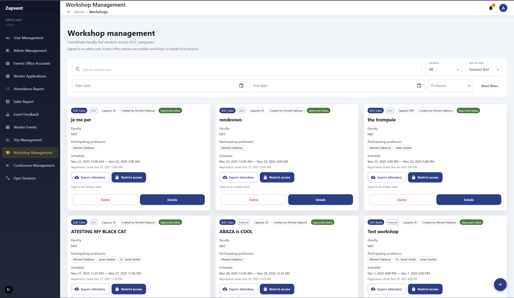
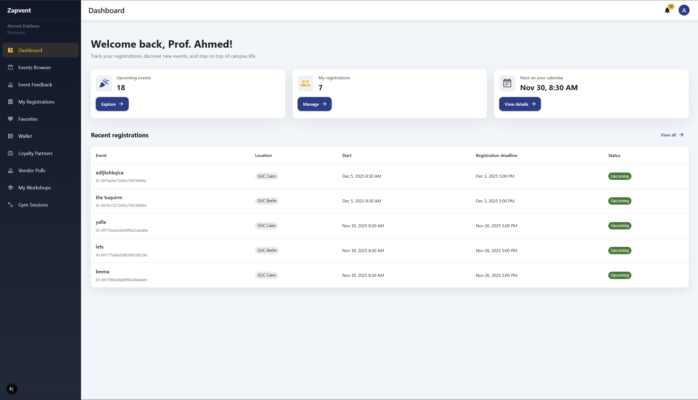
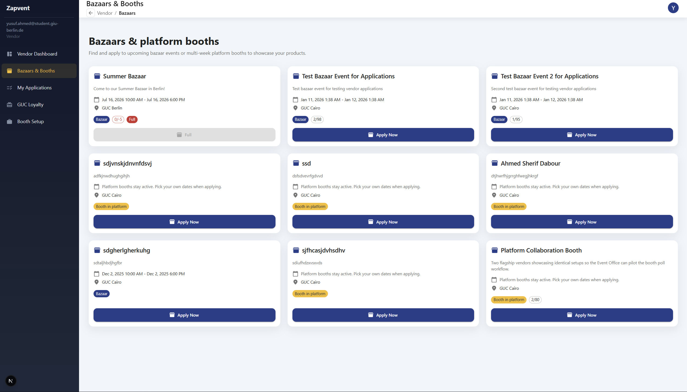
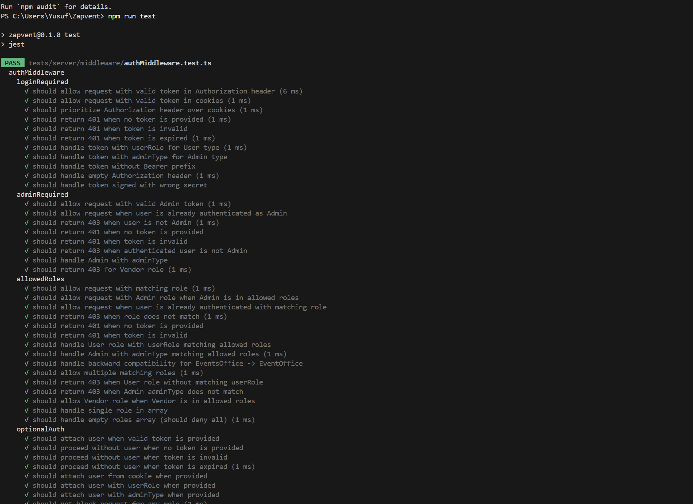
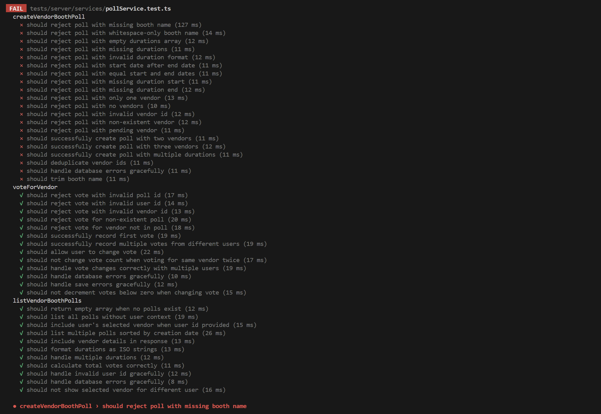
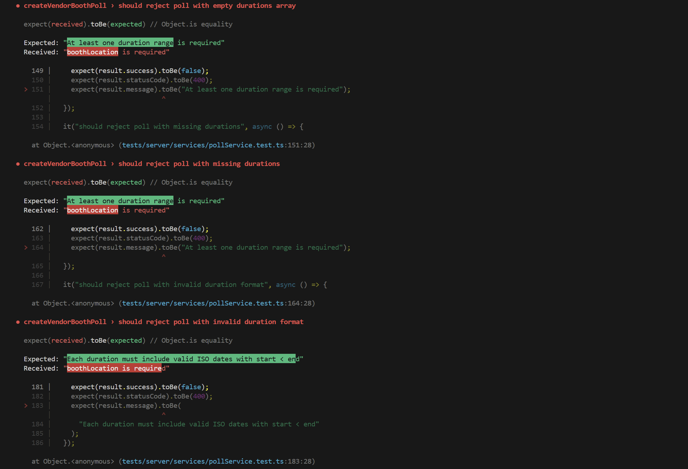
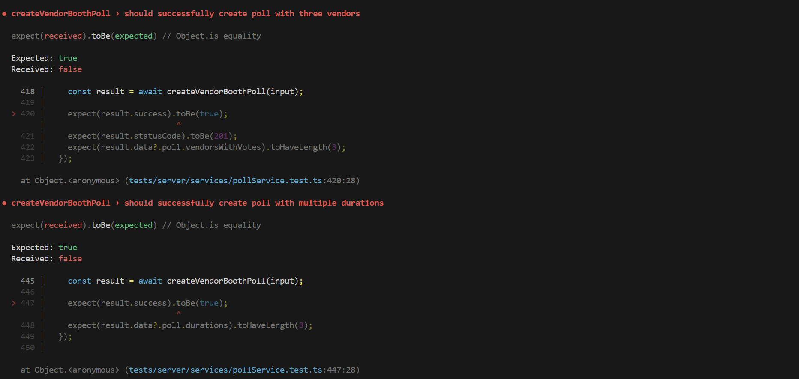

# Zapvent | Smart Campus Events & Vendor Management Platform

Zapvent unifies event planning, vendor coordination, ticketing, and student engagement for university event offices. The platform ships with dedicated portals for administrators, vendors, event-office coordinators, and general users so every workflow (approvals, payments, attendance tracking, feedback, and analytics) happens in one place.

---

## Motivation

- Deliver a centralized workspace where Event Office staff can create bazaars, workshops, and courts without juggling spreadsheets or messaging apps.
- Provide students and vendors with transparent registration, payment, and feedback loops so participation feels safe and predictable.
- Capture real-time operational data (attendance, sales, polls, ratings) that can be surfaced to leadership through dashboards and exports.

---

## Build Status & Known Issues

| Check | Status | Notes |
| --- | --- | --- |
| `npm run dev` | ✅ Boots the Next.js app with mocked API routes. |
| `npm run build && npm start` | ⚠️ Requires `MONGODB_URI`, `JWT_SECRET`, and `STRIPE_SECRET_KEY` env vars before running. |
| `npm run lint` | ✅ Passes on Node 18.18+ (ESLint flat config). |
| `npm run test` | ⏳ Needs up-to-date Jest/Postman evidence (attach screenshot in the **Tests** section). |

### Known issues
- **JWTs logged verbatim:** `server/middleware/authMiddleware.ts` prints the Authorization header and the first 20 characters of every bearer token for each request, so production logs currently leak reusable session tokens and email addresses.
- **Uploads served without auth:** `server/server.ts` mounts `/uploads` as a public static directory, meaning any vendor documents, certificates, or receipts written there can be downloaded by anyone who guesses the filename—there is no signed URL or role gate.
- **No transport hardening on the API:** The Express bootstrap wires up only `cors` and the default `express.json()` middleware, so there is no rate limiting, JSON body-size cap, brute-force protection for `/auth/login/*`, or security headers (`helmet`). Attackers can flood large payloads or infinite login attempts with zero throttling.
- **Wallet/payment writes are not transactional:** `server/services/paymentService.ts` updates `UserPayment`, `User`, and `Event` documents in entirely separate queries. A crash half-way through can debit a wallet without persisting the receipt, while a retry can create duplicate payments because there is no MongoDB transaction or idempotency guard.
- **Event-office reminders never fire for admins:** In `server/services/notificationService.ts`, `sendReminderForEvent` passes attendee IDs into `pushNotificationsToEventOfficeAdmins`, but that helper filters by admin IDs. As a result, Event Office staff never receive the “event starts in 1 day/hour” reminders the UI advertises.
- **Dashboards refetch the whole dataset on every render:** `server/services/eventService.ts#getAllEvents` returns every future event (no pagination), `lib/services/events.ts#fetchUpcomingEvents` pulls the entire array into React Query, and `components/layout/AppShell.tsx` forces the entire authenticated area to run as a client component. Once hundreds of events exist, every dashboard load ships the full dataset to the browser, hurting first paint and memory usage.

---

## Screenshots / Demo Evidence

1.   
	Shows the marketing homepage with spotlighted campus events and primary CTAs for students and vendors.
2.   
	Demonstrates the credential flow, validation states, and role-aware links before redirecting into the portal.
3.   
	Captures the multi-role registration form with student/staff ID capture and password-strength hints.
4.   
	Admin workspace showing event metrics, approval queues, and shortcuts for vendor oversight.
5.   
	Professor portal screenshot with pending workshops, status chips, and certificate automation controls.
6.   
	Vendor experience that surfaces booth assignments, wallet balances, and upcoming bazaar slots in one grid.

---

## Tech / Frameworks Used

- **Next.js 14 (App Router) + React 18** for the authenticated web client.
- **TypeScript** end-to-end for strict typing (frontend, server, and shared libs).
- **Material UI + notistack** for UI components, theming, and toast notifications.
- **Node.js + Express-style server** under `server/` for REST APIs, JWT auth, and business logic.
- **MongoDB + Mongoose** for persistence of users, events, payments, ratings, polls, and reports.
- **Stripe** for payments, wallet top-ups, and reconciliations.
- **Jest + mongodb-memory-server** for deterministic unit/integration tests.
- **Postman** collections for manual/automated API verification.

---

## Features

### Multi-role authentication & profiles
- Students, Staff, Professors, TAs, Vendors, Admins, and Event Office accounts register with role-specific identifiers (student ID, staff ID, company info) and verify via email links before gaining access.
- Central login flows (user, admin, vendor) issue JWT sessions, support password resets, logout everywhere, and prevent blocked/ unverified users from proceeding.
- Profile hubs expose personal data, notification history, wallet balance, linked booths/workshops, and allow users to update credentials or request account deletion.

### Student/Staff/Professor experiences
- Browse and filter every live bazaar, workshop, trip, conference, or loyalty partner by role, location, date, and availability; favorite events for quick access.
- Register for workshops/trips, pay via wallet, credit/debit (Stripe), mixed payments, and download emailed receipts; cancellations auto-refund wallet funds when policy windows permit.
- Track workshop submissions end-to-end: create proposals with agendas/budgets, edit pending drafts, view Event Office feedback, resubmit with requested changes, and send certificates to attendees.
- Join loyalty programs to unlock booth discounts, view accepted vendors, and scan QR codes at events for attendance confirmation.

### Vendor portal
- Self-service vendor onboarding captures KYC data, company docs, and booth preferences; status changes notify applicants via email/notifications.
- Discover upcoming bazaars that match approved categories, review booth layouts (2x2 / 4x4), reserve slots, pay required fees, and upload brand collateral.
- Manage wallet balances, see payment history, request refunds (before deadlines), and monitor booth attendance/footfall analytics pushed by Event Office staff.

### Event Office & Admin operations
- Create and edit bazaars, trips, conferences, and workshops with granular metadata (agenda, limits, resources, location, role restrictions, registration windows).
- Approve/reject vendor applications, workshops, and loyalty partners; request edits with inline comments; archive or delete events while honoring registration safeguards.
- Export attendance, registration, and revenue datasets (CSV/XLSX), drill into vendor queues, and audit student participation per event, date range, or faculty.
- Send broadcast notifications (email + in-app) to students, vendors, and Event Office admins, including reminders for events starting in 1 day/hour and pending vendor reviews.

### Facility & resource management
- Court booking module lets students reserve sports courts, view existing bookings, cancel slots, and respects role-based duration/automatic student ID tagging.
- Gym session scheduler supports creating recurring sessions, editing capacity/duration, enrolling or removing participants, and handling cancellations with automated notifications.
- Marketplace for equipment/loyalty perks allows Event Office/admins to onboard partners, publish discount codes, and let students redeem or view available benefits inside the portal.

### Reporting, compliance & monitoring
- Attendance dashboards aggregate per-event and per-role counts, flag no-shows, and expose exportable detailed reports.
- Sales reports break down revenue by bazaar, booth, and time range; admins can filter by highest/lowest grossing events and compare loyalty vs. non-loyalty purchases.
- Notification center persists audit trails so every role can review sent/received alerts, mark them as read, and understand their outstanding tasks.
- System health section surfaces API heartbeat, scheduler status (reminders/certificates), and database connectivity so on-call admins know when to intervene.

These bullets cover the 87 enumerated requirements from the Sprint backlog, grouped by persona so reviewers can trace each capability back to its implementation in the codebase.

---

## Code Examples

1. **Filter persistence on the client** (`components/events/EventFiltersBar.tsx`)

	 ```tsx
	 const setFilter = <K extends keyof EventFilters>(key: K, filterValue: EventFilters[K]) => {
		 onChange({ ...value, [key]: filterValue });
	 };

	 const handleResetAll = () => {
		 onChange({
			 search: "",
			 eventType: "All",
			 location: "All",
			 sessionType: "All",
			 professor: "",
			 startDate: null,
			 endDate: null,
			 sortOrder: "asc",
		 });
	 };
	 ```

2. **Professor selection guard** (`server/services/eventService.ts`)

	 ```ts
	 async function validateProfessorSelection(input: unknown): Promise<ProfessorSelection> {
		 if (!Array.isArray(input) || input.length === 0) {
			 return { success: false, message: "At least one participating professor is required." };
		 }

		 const seen = new Set<string>();
		 const ids = input
			 .map((value) => (typeof value === "string" ? value.trim() : ""))
			 .filter((value) => {
				 if (!value) return false;
				 if (seen.has(value)) {
					 return false;
				 }
				 seen.add(value);
				 return true;
			 });

		 if (ids.length === 0) {
			 return { success: false, message: "At least one participating professor is required." };
		 }

		 if (ids.some((id) => !Types.ObjectId.isValid(id))) {
			 return { success: false, message: "Invalid professor identifier provided." };
		 }

		 const professors = await UserModel.find({ _id: { $in: ids }, role: userRole.PROFESSOR })
			 .select(["firstName", "lastName"])
			 .lean<Array<IUser & { _id: Types.ObjectId }>>();

		 if (professors.length !== ids.length) {
			 return { success: false, message: "All participating professors must be verified professor accounts." };
		 }

		 const nameMap = new Map<string, string>();
		 professors.forEach((professor) => {
			 nameMap.set(professor._id.toString(), buildProfessorName(professor));
		 });

		 const names = ids.map((id) => nameMap.get(id) ?? "Professor");

		 return { success: true, ids, names };
	 }
	 ```

3. **Wallet + card split payments** (`server/services/paymentService.ts`)

	 ```ts
	 export async function payByWallet(eventId: string, userId: string, payload: PayByWalletInput = {}): Promise<ServiceResponse<PayByWalletData>> {
		 try {
			 const resolved = await ensureEventAndUser(eventId, userId);
			 if (!resolved.success) {
				 return resolved;
			 }

			 const { event, user } = resolved;

			 if (!isRegistrationAllowed(event)) {
				 return {
					 success: false,
					 message: "Payments are only supported for workshops and trips.",
					 statusCode: 400,
				 };
			 }

			 const alreadyRegistered = userIsRegistered(event, userId);
			 if (!alreadyRegistered) {
				 const registrationResult = await registerUserForWorkshop(eventId, userId);
				 if (!registrationResult.success) {
					 return {
						 success: false,
						 message: registrationResult.message ?? "Unable to register for this event before processing payment.",
						 statusCode: registrationResult.statusCode ?? 400,
					 };
				 }
			 }

			 const priceRaw = typeof event.price === "number" && !Number.isNaN(event.price) ? event.price : 0;
			 const price = Math.max(priceRaw, 0);

			 const wantWallet = payload.useWalletBalance ?? (!payload.paymentSource || payload.paymentSource.toLowerCase() === "wallet");
			 const walletBalance = Math.max(user.balance ?? 0, 0);

			 const walletPortion = wantWallet && price > 0 ? Math.min(walletBalance, price) : 0;
			 const remaining = Math.max(price - walletPortion, 0);

			 const cardType = normalizeCardType(payload.paymentSource);

			 if (remaining > 0 && !cardType) {
				 return {
					 success: false,
					 message: "Insufficient wallet balance. Please specify credit or debit card payment.",
					 statusCode: 400,
				 };
			 }

			 const method: PaymentMethod =
				 price === 0 || (remaining === 0 && walletPortion > 0)
					 ? "Wallet"
					 : walletPortion > 0 && remaining > 0
					 ? "Mixed"
					 : cardType ?? "CreditCard";

			 // ...snip... persist payment, send receipt, and return balances
		 } catch (error) {
			 console.error("payByWallet error:", error);
			 return { success: false, message: "Failed to record payment.", statusCode: 500 };
		 }
	 }
	 ```

4. **JWT decoding on the client** (`lib/auth-jwt.ts`)

	 ```ts
	 export function decodeToken(token: string): SessionState | null {
		 try {
			 const [, payloadPart] = token.split(".");
			 if (!payloadPart) {
				 return null;
			 }

			 const payload = JSON.parse(base64UrlDecode(payloadPart)) as TokenPayload;

			 const user: SessionUser = {
				 id: payload.id,
				 email: payload.email,
				 role: payload.role,
				 userRole: payload.userRole,
				 adminType: payload.adminType,
				 name:
					 payload.firstName || payload.lastName
						 ? [payload.firstName, payload.lastName].filter(Boolean).join(" ")
						 : undefined,
				 companyName: payload.companyName,
				 status: payload.status,
				 logo: payload.logo,
			 };

			 return { token, user };
		 } catch {
			 return null;
		 }
	 }
	 ```

5. **Role-aware logout flow** (`components/layout/AppShell.tsx`)

	 ```tsx
	 const handleLogout = async () => {
		 handleMenuClose();
		 try {
			 await fetch("/api/logout", { method: "POST" }).catch(() => undefined);
		 } finally {
			 clearSession();
			 enqueueSnackbar("You have been logged out.", { variant: "info" });
			 const role = session?.user.role ?? null;
			 if (role) {
				 router.replace(getLoginPathForRole(role));
			 } else {
				 router.replace("/login/user");
			 }
		 }
	 };
	 ```

---

## API References

| Method | Route | Description | Auth |
| --- | --- | --- | --- |
| POST | `/api/auth/login/user` | Issue JWT for students/staff/professors/TAs. | Public (credentials) |
| POST | `/api/auth/login/vendor` | Vendor control-panel login. | Public (credentials) |
| GET | `/api/auth/verify-email` | Confirms signup tokens then redirects to the login screen. | Public via emailed link |
| POST | `/api/users/signUp` | Register a student/staff/professor/TA with ID validation. | Public |
| GET | `/api/users/favorites` | List the events a user favorited. | Authenticated Student/Staff/Professor/TA |
| GET | `/api/users/wallet/refunds` | View wallet refund history and balances. | Authenticated Student/Staff/Professor/TA |
| POST | `/api/vendors/signUp` | Vendor onboarding (multipart upload for logos/docs). | Public |
| GET | `/api/vendors/my-applications` | Vendor’s bazaar applications + statuses. | Authenticated Vendor |
| PATCH | `/api/vendors/bazaar-application/status` | Approve/reject vendor booth requests. | Admin / Event Office |
| GET | `/api/events` | List bazaars/workshops/trips with filters/pagination. | Public |
| POST | `/api/events/workshop` | Submit a workshop proposal including agenda/budget. | Authenticated Professor / Admin |
| POST | `/api/events/:id/pay-by-wallet` | Register attendee and process wallet/mixed payment. | Authenticated Student/Staff/Professor/TA |
| POST | `/api/events/:id/stripe/payment-intent` | Start a Stripe card payment for an event. | Authenticated Student/Staff/Professor/TA |
| GET | `/api/events/:eventId/applications` | Fetch vendor applications for a bazaar. | Admin / Event Office |
| PATCH | `/api/events/workshop/:id/approve` | Approve a proposed workshop submission. | Event Office |
| GET | `/api/events/:id/export-registrations` | Export attendance as XLSX/CSV. | Event Office |
| GET | `/api/courts` | List courts and their basic info. | Public |
| POST | `/api/courts/:courtId/reservations` | Reserve a court slot (auto-stores student ID). | Authenticated Student |
| GET | `/api/gym-sessions/schedule` | View the gym session calendar by month. | Public |
| POST | `/api/gym-sessions/:id/register` | Join or cancel a gym session. | Authenticated Student/Staff/Professor/TA |
| GET | `/api/polls` | Retrieve live vendor booth polls to vote on. | Authenticated Student/Staff/Professor/TA |
| POST | `/api/polls/:pollId/vote` | Cast a vote for a vendor/booth. | Authenticated Student/Staff/Professor/TA |
| POST | `/api/comments/events/:eventId` | Leave event comments/feedback. | Authenticated User |
| DELETE | `/api/comments/:commentId` | Remove inappropriate comments. | Admin / Event Office |
| POST | `/api/ratings/events/:eventId` | Submit an event rating (1–5 stars + review). | Authenticated User |
| GET | `/api/admin/notifications` | Fetch Event Office/admin notification inbox. | Event Office / Admin |
| POST | `/api/admin/polls` | Publish new vendor booth polls for attendees. | Event Office |


---

## Tests

- Test runner: **Jest** with `mongodb-memory-server` for backend services, plus **Postman** regression suites for HTTP flows.
- Run everything locally: `npm run test`
- Evidence snapshots (kept under `public/docs/screenshots/testing/`):
	- 
	- 
	- 
	- 
	- 

| Test File / Collection | Focus | Notes |
| --- | --- | --- |
| `tests/server/services/adminService.test.ts` | Admin creation, impersonation guardrails. | Uses fixtures + memory Mongo. |
| `tests/server/services/courtService.test.ts` | Booking conflict detection + slot limits. | Validates overlapping reservations. |
| `tests/server/services/gymSessionService.test.ts` | Gym session CRUD, attendance caps. | Ensures waitlist logic works. |
| `tests/server/services/loginService.test.ts` | Credential validation + JWT issuance. | Stubs bcrypt + token signing. |
| `tests/server/services/notificationService.test.ts` | Notification fan-out when events publish. | Verifies unread counters per role. |
| Postman `Events Office` collection | End-to-end approvals + payments. | Collection run shown in testing screenshot #4. |

---

## Contribute

1. Fork the repo, create a branch named `feature/<short-description>`.
2. Install dependencies (`npm install`) and run `npm run lint && npm run test` before pushing.
3. Open a pull request that includes: motivation, screenshots, testing evidence, and any environment setup notes.
4. For bug reports, include reproduction steps, expected vs. actual behavior, and attach screenshots/logs.

We especially welcome contributions that tackle the open items highlighted in **Known issues**

- **Security hardening:** replace the verbose token logging in `server/middleware/authMiddleware.ts`, lock down `/uploads`, and add rate limiting/helmet middleware so production traffic is safe.
- **Payment reliability:** wrap the wallet/card flows in Mongo transactions or add idempotent operations so partial writes can’t drain balances.
- **Notification accuracy:** fix the reminder scheduler so Event Office admins actually receive the 1-day/1-hour pings and add tests to cover the fan-out edge cases.
- **Performance & UX:** paginate `GET /api/events`, convert heavy client components back to server components, and add caching so dashboards stay fast when data grows.
- **Test evidence:** expand Jest coverage (especially around payment + uploads) and automate the Postman runs so the README screenshots reflect CI status.

---

## Credits

- Next.js, React, and Vercel documentation for routing, caching, and deployment guides.
- Material UI + notistack docs for theming and notification patterns.
- Stripe API docs for payment intents, wallet balance management, and webhook flows.
- MongoDB + Mongoose guides for schema design and aggregation pipelines.

---

## License

- Application code is released under the [MIT License](LICENSE).
- Stripe SDK (Apache 2.0) and any other third-party packages retain their original licenses—see `package.json` for the complete list.
- Custom UI assets (logos, mock banners, screenshots) were created specifically for this project and are released under the same MIT terms; if you replace them with third-party artwork/fonts, document those licenses here before shipping.

This is a [Next.js](https://nextjs.org) project bootstrapped with [`create-next-app`](https://nextjs.org/docs/app/api-reference/cli/create-next-app).

## Getting Started

First, run the development server:

```bash
npm run dev

# Build production bundles
npm run build
npm start

# Lint & type-check
npm run lint
```